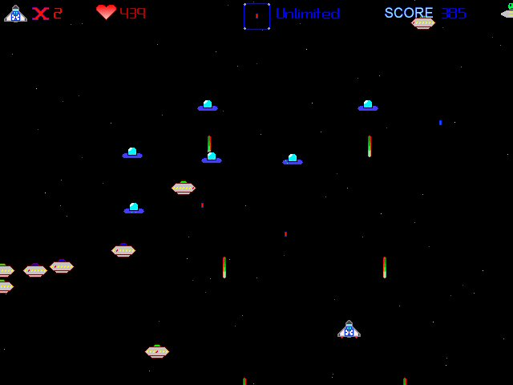

# Blasteroid

A Space Invaders style game created using C++ and DirectX.

## Get it

[Download it](Installers/) and check it out.
To ensure everything works properly, it's recommended you use the `Blasteroid Installer.exe`.
If you don't want to 'install' the game, you can instead download the `Blasteroid Executable.zip` and run the `Blasteroid.exe`, although the fonts may not display correctly.

## Requirements

You will need at least DirectX 8.1 installed to play the game.

## History

Blasteroid was the second game I created.
I started it in 2004, and continued to work on it into 2005, while a student at the University of Regina.

The game has 3 levels, which are loaded from script files and more levels could easily be added.
The enemies use a simple AI system that I developed to determine when to attack your ship and when to flee, although it may be tough to see this as the screen often quickly fills up with enemies.

Most of the graphics and sound effects were made by me, but the music and some of the graphics are from 3rd party sources.

I've uploaded the code and installer for posterity sake.
Feel free to check out [the source code](src/) 🙂
However, please don't judge me by it as it was written near the start of my programming career when I still had much to learn 😉
